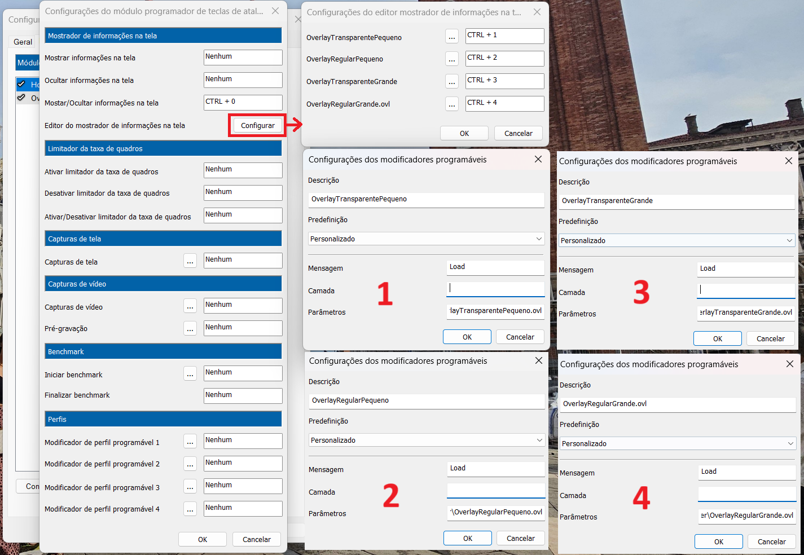
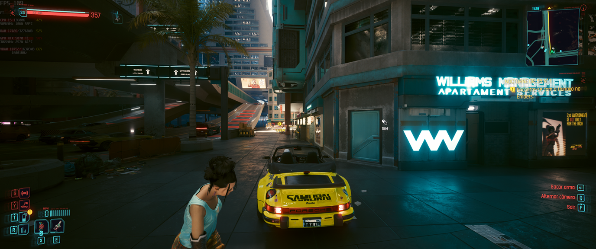
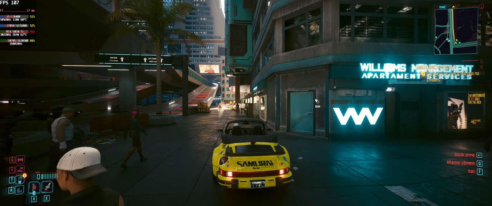
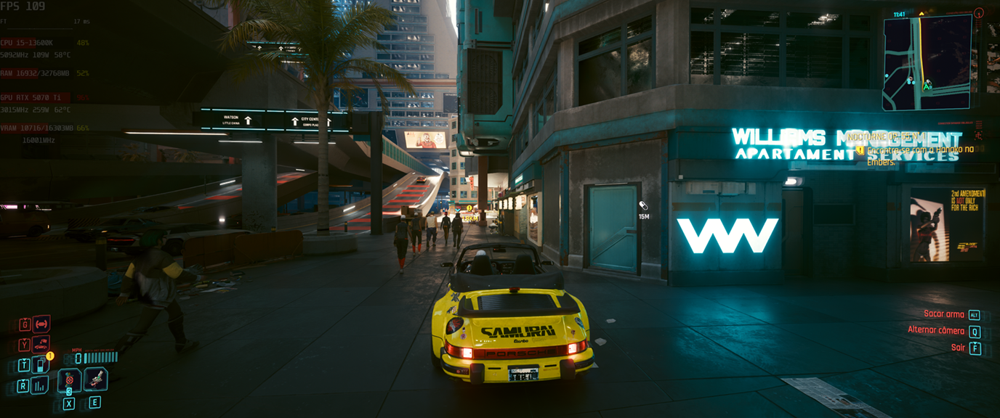
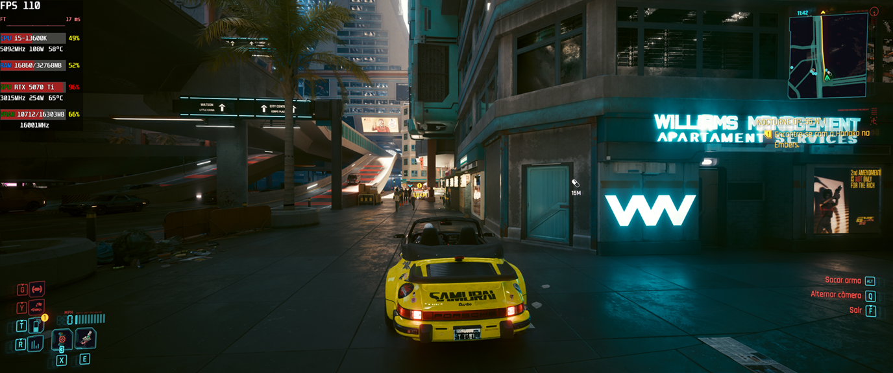

# Meu-Overlay-RTSS-Custom
São 4 perfis de overlay do RivaTuner junto com o MSI Afterburner

Perfis:
1. Pequeno transparente
2. Pequeno 100% visível
3. Grande transparente
4. Grande 100% visível

Configurações necessárias:
1. Setup > aba Plugins > Habilitar ambos os plugins “HotkeyHandler.dll e OverlayEditor.dll”
2. Entrar em HotkeyHandler.dll > Mostrador de informações na tela > Configurar > Configurar os 4 overlays conforme imagem, cada um com seu atalho “Ctrl + X”, mensagem “Load” e puxar o caminho completo nos parâmetros (exemplo): D:\CaminhCompleto\CaminhCompleto\CaminhCompleto\XXX.ovl (SEMPRE .ovl)

Informações adicionais:
- NÃO é necessário alterar o título do modelo da CPU e GPU por exemplo pois ele usa dinamicamente do sistema.
- Eu optei por buscar as informações SOMENTE do Riva e MSI e não usar softwares externos como o hwinfo por exemplo para diminuir a complexidade e risco de problemas.
- Para as porcentagens de uso dos componentes, fiz um threshold de acordo com o meu hardware (CPU, GPU, RAM e VRAM) ajuste as cores das porcentagens para o seu hardware.
- Para as temperaturas de CPU e GPU também se faz necessário ajustar o threshold para o seu hardware.

Exemplos em funcionamento dos 4 overlays diferentes:

